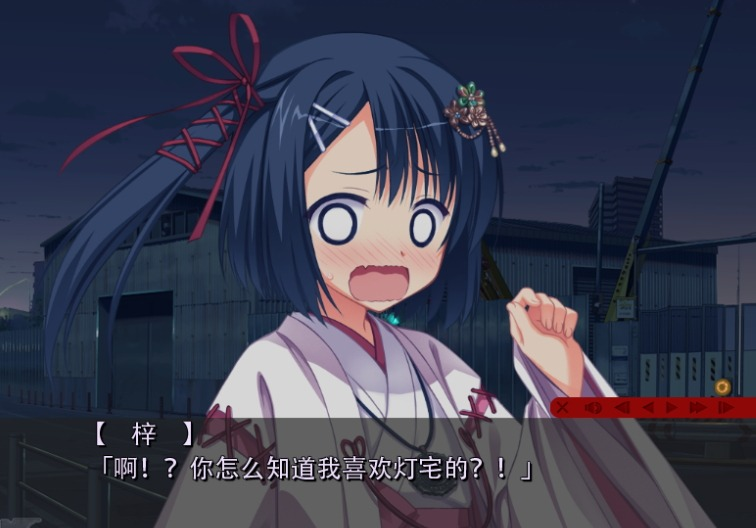

### KiriKiriZSM ~5.6 (Final?)
[](http://vnx.uvnworks.com)

A DLL Library tool to allow you write your own string editor or resouce manager in C#
Tested with: Nekopara Vol.0 & Vol.1, Dracu+Riot, Wagamama [Steam ver] (.scn, .pimg and .psb), TJS2100

### Any problem with my shit?
Try use this: https://github.com/UlyssesWu/FreeMote/tree/master/FreeMote.Tools.PsbDecompile

This tool is a proper PSB Editor, can help you with the .pimg, .psb, .scn too.


[Embedded Bitmap Tutorial](https://youtu.be/2OlgmNdK5UU)

[ZLIB LICENSE](https://raw.githubusercontent.com/marcussacana/KrKrZSceneManager/master/KrKrSceneManager/Zlib/license.txt)


---
# what I have change:
    - KrKrZSceneManager/ScnEditorGUI/Form1.cs
    
    content:
    
    Line 40:
    ```
        //增加到外部编辑器
                System.IO.File.AppendAllLines(@"H:\YUZUSOFT\scn.txt", SCN.Import());
    ```
    
    Line 81
    ```
    //狸猫换太子

                    string[] AimString = System.IO.File.ReadAllLines(@"H:\YUZUSOFT\scn.txt");
    ```
    
    note:
    直接在打开*.scn时输出到H:\YUZUSOFT\scn.txt，先不要退出，打开文本进行编辑（可以使用强大的正则），保存修改后文本后，程序中保存即可生成scn。
    最终效果如下：
    
    
